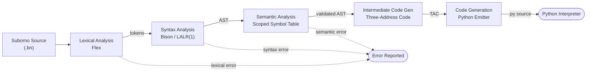

<div align="center">

# Suborno

### A Bengali-Syntax Programming Language Compiler with Python Code Generation

*Write programs in Bengali. Run them as Python. Watch every compilation stage happen live.*

[](https://isocpp.org/)
[](https://github.com/westes/flex)
[](https://www.gnu.org/software/bison/)
[](https://www.python.org/)
[](https://flask.palletsprojects.com/)
[](https://www.docker.com/)
[](https://railway.app/)
[](#license)

[Overview](#overview) ·
[Features](#features) ·
[Architecture](#architecture) ·
[Language](#language-design) ·
[Quick Start](#quick-start) ·
[API Reference](#api-reference) ·
[Project Structure](#project-structure) ·
[Limitations](#known-limitations--roadmap)

</div>

---

## Overview

**Suborno** is a statically-typed, block-scoped programming language whose entire surface syntax — keywords, boolean literals, and its built-in print statement — is written in Bengali script. Its compiler is a source-to-source translator (a *transpiler*): validated Suborno programs are lowered through a classical compiler pipeline — lexical analysis, LALR(1) parsing, semantic analysis, three-address-code generation, and code generation — into equivalent, executable **Python 3** source code.

The project ships in two forms built from the same core:

| Form | Description |
|---|---|
| **Native CLI compiler** | A C++17 binary built from a Flex lexer and a Bison LALR(1) parser. Reads `input.bn`, writes tokens, AST, symbol table, TAC, and generated Python to disk. |
| **Web compiler lab** | A Flask application that runs the native binary per request and streams its *genuine* output — not a simulation — to an interactive, dependency-free browser front end. |

---

## Features

- **Localized syntax** — every keyword, boolean literal, and the print statement are native Bengali words; identifiers may freely mix Bengali and Latin script.
- **Full classical pipeline** — lexer, LALR(1) parser with an AST, scoped semantic analyzer, three-address-code generator, and a Python code generator, each independently inspectable.
- **Static typing with four primitives** — `int`, `decimal`, `string`, `bool`, with declaration, initialization, and type-compatibility checking.
- **Structured control flow** — `if` / `else`, `while`, `break`, and `continue`, with mandatory braced blocks and a full C-like operator-precedence expression grammar.
- **Live, stage-by-stage visualization** — the web interface renders the actual token stream, parse tree, symbol table, TAC, and generated Python for whatever program the user submits.
- **Reproducible, artifact-free builds** — generated parser/lexer sources and the compiled binary are excluded from version control and regenerated deterministically at build time.
- **Sandboxed execution** — each web request runs in an isolated temporary directory with enforced source-size and execution-time limits, and no submitted code persists after the request completes.

---

## Architecture

Suborno follows a single-pass, six-stage pipeline. Each stage's output is persisted independently so the front end can render the compiler's actual internal state, not an approximation of it.



Any lexical, syntax, or semantic error short-circuits the pipeline immediately and is reported to the caller with a line number; TAC generation, code generation, and execution are only ever attempted for a program that clears all three gates.

**Service layers** (web deployment):

```
Browser (templates/index.html)
        │  POST /api/compile  { source, run }
        ▼
Flask application (app.py)
        │  spawns, in an isolated temp directory, with size/time limits
        ▼
Native compiler binary (compiler/)
        │  writes tokens.txt · parse_tree.txt · semantic.txt · tac.txt · output.py
        ▼
Flask reassembles one JSON response ──▶ Browser renders tabs
```

---

## Language Design

### Keywords

| Suborno | Token | Meaning |
|---|---|---|
| `সংখ্যা` | `TYPE_INT` | `int` |
| `দশমিক` | `TYPE_DECIMAL` | `decimal` |
| `স্ট্রিং` | `TYPE_STRING` | `string` |
| `সত্যতা` | `TYPE_BOOL` | `bool` |
| `যদি` | `IF` | `if` |
| `নাহলে` | `ELSE` | `else` |
| `যতক্ষণ` | `WHILE` | `while` |
| `দেখাও` | `PRINT` | `print` |
| `বিরতি` | `BREAK` | `break` |
| `চালিয়ে_যাও` | `CONTINUE` | `continue` |
| `সত্য` / `মিথ্যা` | `TRUE_LIT` / `FALSE_LIT` | `true` / `false` |
| `এবং` / `অথবা` | `AND` / `OR` | `and` / `or` |

### Example

<table>
<tr><th>Suborno (<code>input.bn</code>)</th><th>Generated Python (<code>output.py</code>)</th></tr>
<tr valign="top">
<td>

```
সংখ্যা ক = 10;
সংখ্যা খ = 5;

যদি (ক > খ)
{
    দেখাও("ক বড়");
}
নাহলে
{
    দেখাও("খ বড়");
}
```

</td>
<td>

```python
ক = 10
খ = 5

if ক > খ:
    print("ক বড়")
else:
    print("খ বড়")
```

</td>
</tr>
</table>

Operator precedence (lowest to highest): `অথবা` → `এবং` → `==`/`!=` → `<`,`<=`,`>`,`>=` → `+`,`-` → `*`,`/` → unary `!` → unary `-`.

> Blocks are **mandatory**: `if`/`while` bodies must always be brace-delimited. A bare block is *not* a valid standalone statement — the only way to open a nested scope is via an `if` or `while` body.

---

## Quick Start

### Option A — Railway (no GitHub required)

```bash
npm install -g @railway/cli
railway login
railway init
railway up
```

Railway builds directly from the included `Dockerfile`; `/health` is used as the platform health check.

### Option B — Docker (local)

```bash
docker build -t suborno .
docker run -p 8000:8000 suborno
```

### Option C — Local build (Linux / macOS)

```bash
./build-local.sh              # regenerates the parser/lexer and compiles the binary
pip install -r requirements.txt
python app.py
```

### Option D — Local build (Windows)

```powershell
./build-local.ps1
pip install -r requirements.txt
python app.py
```

**Requirements:** `g++` (C++17), `flex`, `bison`, Python ≥ 3.9.

---

## API Reference

### `POST /api/compile`

**Request body**

```json
{
  "source": "সংখ্যা x = 10;\nদেখাও(x);",
  "run": true
}
```

**Response body**

```json
{
  "success": true,
  "tokens": "...",
  "ast": "...",
  "semantic": "...",
  "tac": "...",
  "python": "x = 10\nprint(x)",
  "output": "10",
  "errors": []
}
```

### `GET /health`

Liveness probe consumed by the deployment platform; returns `200 OK` when the compiler binary is present and executable.

### Configuration

| Variable | Default | Purpose |
|---|---|---|
| `PORT` | platform-assigned | HTTP listen port |
| `COMPILER_PATH` | bundled binary path | Location of the native compiler executable |
| `MAX_SOURCE_BYTES` | `50000` | Maximum accepted source size per request |
| `COMPILE_TIMEOUT` | `5` (seconds) | Wall-clock limit for the compile subprocess |
| `RUN_TIMEOUT` | `2` (seconds) | Wall-clock limit for executing generated Python |

---

## Project Structure

```
suborno-compiler-education-railway/
├── compiler/
│   ├── lexer.l           # Flex lexical specification
│   ├── parser.y           # Bison grammar + AST construction
│   ├── AST.cpp             # ASTNode + node-factory functions
│   ├── semantic.cpp        # Symbol table, scope stack, type checking
│   ├── tac.cpp             # Three-address-code generator
│   ├── codegen.cpp         # Python code generator
│   ├── compiler.cpp        # Orchestrates all five phases
│   └── main.cpp            # CLI entry point
├── app.py                  # Flask web application
├── templates/index.html    # Browser front end (no external JS framework)
├── examples/integration.bn # Bundled sample program
├── Dockerfile               # Two-stage build (compile → slim runtime)
├── railway.json             # Railway deployment configuration
├── requirements.txt
├── build-local.sh / .ps1
└── regenerate-parser.sh
```

Generated files (`lex.yy.c`, `parser.tab.*`, the compiled binary) are intentionally excluded from version control and are rebuilt deterministically at build time.

---

## Known Limitations & Roadmap

This project documents its own edge cases rather than hiding them:

- **Integer-division type inconsistency.** `সংখ্যা / সংখ্যা` is statically classified as `int`, but the code generator lowers every `/` to Python's true-division operator, so the runtime result is a `float`. *Planned fix:* emit Python's `//` when both static operand types are `int`.
- **Scope-erasure on shadowing.** The semantic analyzer correctly tracks a variable shadowed inside a nested `if`/`while` block as a distinct symbol, but the code generator has no scope-aware renaming, so the inner assignment silently overwrites the outer Python variable at run time. *Planned fix:* scope-qualified name mangling in the code generator.
- **No user-defined functions, arrays, or modules** — single translation unit, no composite types, no standard library beyond `দেখাও`.
- **No classical IR optimizations** (constant folding, dead-code elimination) — the TAC uses structural control-flow markers rather than a labelled/GOTO form.
- **Manual memory management** for AST nodes (raw `new`, no smart pointers).

**Roadmap:** user-defined functions and parameters · arrays and a `for` construct · a labelled three-address IR enabling classical optimizations and non-Python backends · automated regression tests against golden output · source-level debugging (Suborno line numbers back-mapped from generated Python).

---

## Contributing

Issues and pull requests are welcome. Please regenerate the parser/lexer (`./regenerate-parser.sh` or `build-local.sh`) and verify the binary compiles cleanly before submitting changes to `compiler/`.

## Contributors

| Name | Student ID |
|---|---|
| Utsho Paul | 0182320012101370 |
| Bithi Rani Nath Borna | 0182320012101382 |
| Syeda Sadiatul Jannat Tushi | 0182320012101405 |

## License

No license has been specified for this repository yet. Until a `LICENSE` file is added, all rights are reserved by the project author(s).

<div align="center">

*Suborno — because learning to program shouldn't require learning English first.*

</div>
